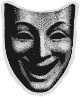

# Alisson Machado

**Estudante de cibersegurança com foco em AppSec, OffSec, segurança web e automação.**

`quebrar para entender | construir para fortalecer | repetir`

---

### Sobre mim

Sou estudante de **Análise e Desenvolvimento de Sistemas** e estou construindo minha carreira em cibersegurança.

Meu foco é entender como softwares, redes e aplicações web falham para desenvolver sistemas mais difíceis de comprometer. Tenho interesse especial em **segurança ofensiva, AppSec, segurança web, desenvolvimento de ferramentas de segurança, bug bounty e automação**.

Também tenho experiência prática com **suporte de TI e help desk**, resolução de problemas, redes, Windows, Linux e atendimento técnico, o que me ajuda a abordar segurança com uma visão prática e sistêmica.

 

---

### Stack e ferramentas

#### Linguagens e dados

#### Sistemas e linha de comando

#### Ferramentas

 

---

### Atualmente estudando

- Segurança web, AppSec e testes de vulnerabilidades
- Fundamentos de redes, Linux e computação em nuvem
- Programação segura e análise de vulnerabilidades
- Automação de reconhecimento e scripts com Python
- Desenvolvimento, desempenho e testes de ferramentas de segurança
- Fundamentos de binários e representação de dados em baixo nível

 

---

### Principais interesses

- Segurança de aplicações e segurança web
- Segurança ofensiva e bug bounty
- Desenvolvimento de ferramentas de segurança
- Reconhecimento e automação
- Pesquisa de exploits
- Inteligência artificial aplicada à cibersegurança
- Crawlers, mapeamento e ferramentas de descoberta

Tenho fascínio por aranhas, tanto pelas reais quanto pelas ferramentas do tipo *spider*, que percorrem aplicações, mapeiam superfícies de ataque e ajudam a revelar caminhos ocultos.

 

---

## Projetos em destaque

### [Subdomainabber](https://github.com/amchdd/subdomainabber)

Ferramenta de varredura em **Go** para investigar possíveis casos de takeover de subdomínio em avaliações de segurança autorizadas, correlacionando **DNS, HTTP e TLS**, registrando evidências reproduzíveis e mantendo histórico local em SQLite.

### [HuntingWriteUps](https://github.com/amchdd/HuntingWriteUps)

Coleção de write-ups técnicos em **português e inglês** sobre vulnerabilidades e pesquisas práticas de segurança, com documentação voltada a análise, impacto e aprendizado reproduzível.

---

## Mentalidade

Gosto de aprender como as coisas quebram, porque geralmente é aí que estão as lições mais profundas.

Minha abordagem é simples: estudar os fundamentos, construir com consistência, testar na prática e continuar evoluindo uma camada de cada vez.

---

## Entre em contato

- E-mail: [alissonmc.dev@gmail.com](mailto:alissonmc.dev@gmail.com)
- LinkedIn: [www.linkedin.com/in/amchdd](https://www.linkedin.com/in/amchdd)
