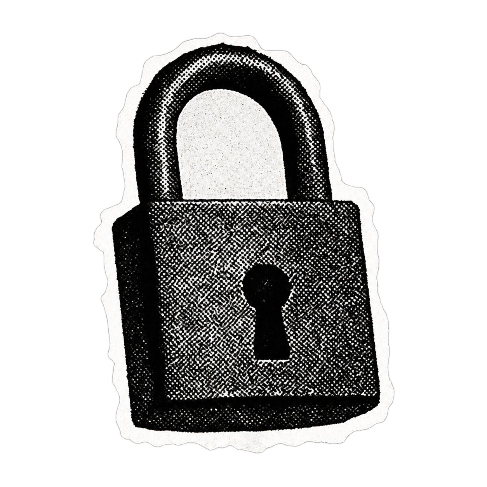
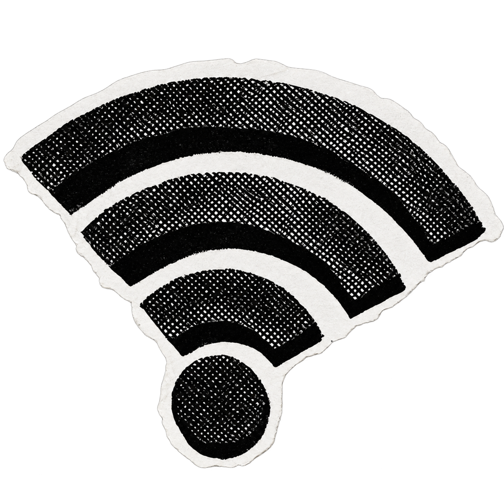
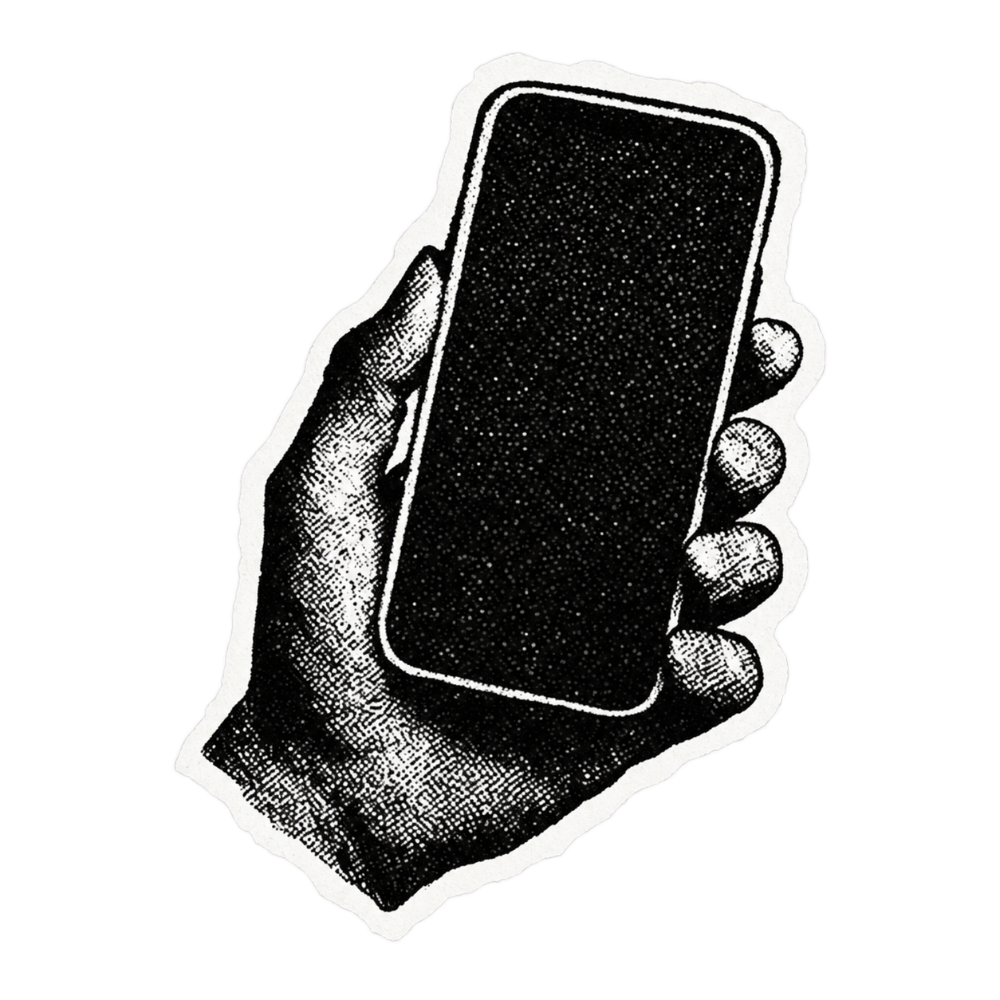
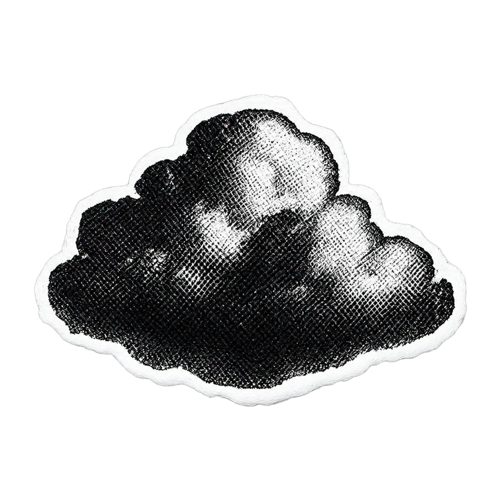

# Alisson Machado

**Cibersegurança · SOC/Blue Team · Redes e automação**

Busco uma oportunidade como **Analista SOC N1 ou estagiário em cibersegurança**.

Quero entender como as defesas detectam, investigam e respondem a ameaças, construindo uma base sólida para avançar em pesquisa ofensiva no longo prazo.

## Sobre mim

Sou estudante de **Análise e Desenvolvimento de Sistemas na UNINASSAU**, com conclusão prevista para 2027, e estagiário de **Help Desk**. Minha base profissional envolve diagnóstico de hardware, software e conectividade, atendimento de chamados, configuração de contas e permissões, documentação e automação de tarefas com scripts.

Gosto de investigar como sistemas funcionam, entender causas e documentar evidências. Conecto minha experiência de suporte aos estudos de segurança, à pesquisa de vulnerabilidades e ao desenvolvimento de ferramentas.

##  Redes e detecção

### [SOC Home Lab — Wazuh](https://github.com/amchdd/soc-homelab)

Pratico coleta de logs, regras de detecção, correlação de falhas de autenticação, **FIM** e triagem com um endpoint Linux e agente Wazuh em Docker. Valido 18 casos no motor e 12 testes das ferramentas, com evidências e playbooks para investigar contexto, falsos positivos e critérios de escalonamento.

As operações SSH e de criação, alteração e exclusão de arquivos são reais e controladas; os eventos JSON de autenticação e PowerShell são **simulados**. Registro origem, hashes e resultados em um relatório estático de estudo.

### [Subdomainabber](https://github.com/amchdd/subdomainabber)

Desenvolvo uma ferramenta em **Go** para investigação autorizada de subdomínios. Correlaciono DNS, HTTP e TLS, registro histórico em SQLite e uso evidências reproduzíveis para apoiar a análise. O projeto também implementa assinatura **Ed25519** de bundles de evidências, com verificação de integridade.

##  Pesquisa e bug bounty

Minha prática inclui pesquisa em programas reais de bug bounty e análise de aplicações e APIs. No [HuntingWriteUps](https://github.com/amchdd/HuntingWriteUps), documento descobertas reais com dados dos alvos ocultados, incluindo **falhas de autorização em APIs (BOLA/IDOR)** e **injeção de comandos**.

Documento reprodução, causa raiz, evidências, impacto e recomendações, preservando informações dos ambientes analisados e respeitando o escopo dos programas.

##  Segurança pelo celular

Também realizo análises de segurança a partir de dispositivos **Android com Termux**, incluindo reprodução e validação técnica de vulnerabilidades conhecidas. Documento os resultados com ferramentas de linha de comando.

##  Nuvem e criptografia aplicada

### [Doces da Mari](https://docesdamari.com.br/)

Desenvolvo uma aplicação real de catálogo e gestão de encomendas, com **React, TypeScript, Node.js, Express e PostgreSQL**. O código é privado; o site pode ser visitado pelo link acima.

Aplico conhecimentos de nuvem com **Vercel**, **Cloudflare**, **Supabase** e **Redis**: implantação, DNS/TLS, proteção de acesso, armazenamento de imagens e controles de requisição e autenticação.

Tenho interesse em criptografia aplicada: utilizo **Argon2id para senhas**, **AES-256-GCM para dados pessoais** e **TLS para comunicação com o banco**. Conecto desenvolvimento, infraestrutura e segurança à proteção dos dados de uma aplicação em uso.

## Stack aplicada em projetos

**Linguagens**

**Web e dados**

**Nuvem**

**Ambiente e defesa**

## Formação e foco de curto prazo

Meu foco atual é **SOC/Blue Team**: redes, Windows/Linux, análise de logs, detecção, triagem e fundamentos de resposta a incidentes. Quero aprender como os controles defensivos funcionam e como transformar alertas em investigações bem fundamentadas.

Mantenho prática no [TryHackMe](https://tryhackme.com/p/bl1tzz) e formação pela **Cisco Networking Academy**, **Linux Foundation** e **C++ Institute**. Concluí Networking Basics, Networking Devices and Initial Configuration, Introduction to Cybersecurity e Junior Cybersecurity Analyst Path em 2026.

## Direção de longo prazo

Quero avançar em **Reverse Engineering, Exploit Development, Malware Analysis e Purple Team** após consolidar minha base defensiva. Estudo **C, C++ e Assembly** como fundamentos para compreender programas, memória e comportamento em baixo nível. Essa direção orienta meu desenvolvimento futuro; minha prioridade profissional hoje é SOC.

